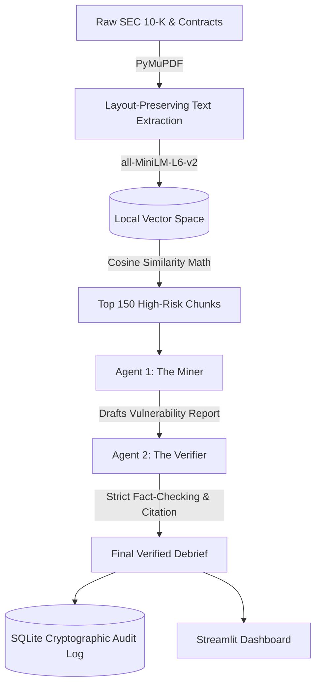

# Vault AI: Air-Gapped Agentic RAG for M&A Due Diligence

## 📌 Business Value
Mergers and Acquisitions (M&A) due diligence traditionally requires analysts to spend hundreds of hours manually parsing massive corporate documents (SEC 10-Ks, employment contracts, vendor agreements). Vault AI automates this bottleneck using a 100% local, air-gapped Agentic RAG (Retrieval-Augmented Generation) pipeline. It identifies hidden liabilities, unusual termination clauses, and critical negotiation leverage in seconds. By utilizing local large language models and a dual-agent verification system, Vault AI ensures absolute data privacy and cryptographic auditability without the risk of hallucinations.

## 🏗️ System Architecture
The pipeline is designed for high-stakes financial environments where data privacy is mandatory. It processes documents locally, filtering noise through neural embeddings before passing high-risk semantic chunks to an adversarial dual-agent system.



## 🚀 Key Enterprise Features
* **100% Air-Gapped Processing:** Built on Llama 3 via Ollama, ensuring zero bytes of confidential deal data ever leave the local network.
* **Dual-Agent Verification Loop:** Agent 1 (The Miner) extracts strategic insights, while Agent 2 (The Verifier) ruthlessly fact-checks the draft against the source text. Unsubstantiated claims are deleted before reaching the user.
* **Pinpoint Page Citations:** The engine retains document metadata throughout the vectorization process, appending exact `[DOC: X | PAGE Y]` citations to every flagged liability.
* **Cryptographic Audit Trail:** Every scan, finding, and timestamp is permanently logged in a secure local SQLite database, establishing a defensible compliance record.
* **Deep Vision Ingestion:** Utilizes PyMuPDF to preserve the layout of financial tables and complex document structures that standard parsers break.

## 💻 Local Setup & Execution

### Prerequisites
* [Ollama](https://ollama.com/) installed and running locally.
* Python 3.10+

### Installation
```powershell
# 1. Clone the repository
git clone [https://github.com/yyorganci99-cmyk/vault-ai.git](https://github.com/yyorganci99-cmyk/vault-ai.git)
cd vault-ai

# 2. Pull the local LLM brain
ollama run llama3

# 3. Create and activate a virtual environment
python -m venv venv
.\venv\Scripts\activate

# 4. Install dependencies
pip install -r requirements.txt

# 5. Launch the terminal
streamlit run miner.py
```
